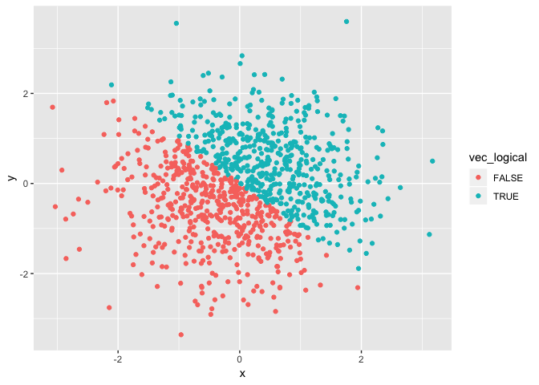
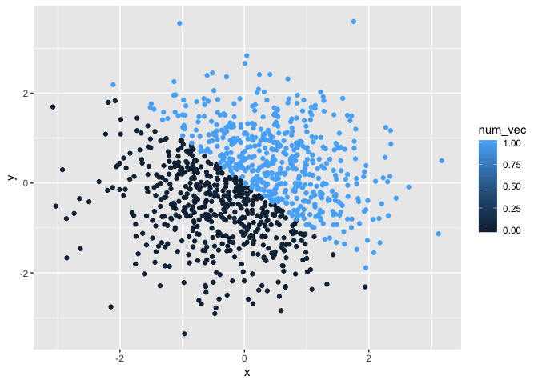
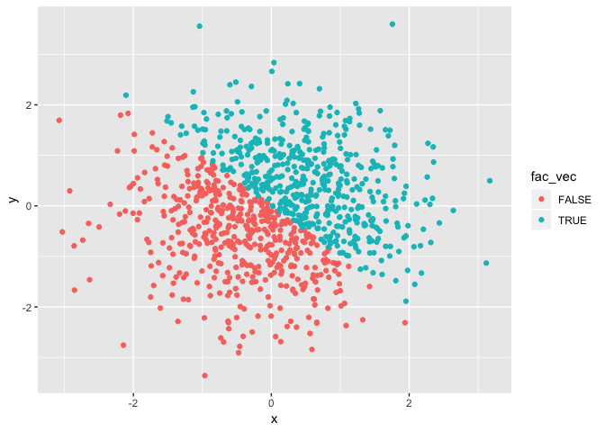

P8105\_hw1\_ykk2116
================
Yaa Klu
9/19/2018

## Problem 1

### Creating a data frame

``` r
library(tidyverse)
```

    ## ── Attaching packages ─────────────────────────────────────────── tidyverse 1.2.1 ──

    ## ✔ ggplot2 3.0.0     ✔ purrr   0.2.5
    ## ✔ tibble  1.4.2     ✔ dplyr   0.7.6
    ## ✔ tidyr   0.8.1     ✔ stringr 1.3.1
    ## ✔ readr   1.1.1     ✔ forcats 0.3.0

    ## ── Conflicts ────────────────────────────────────────────── tidyverse_conflicts() ──
    ## ✖ dplyr::filter() masks stats::filter()
    ## ✖ dplyr::lag()    masks stats::lag()

``` r
set.seed(758)

example_df1 = tibble(
  numbers = runif(10, min = 1, max = 5),
  vec_logical = numbers > 2,
  vec_char = c("Liberia", "Tanzania", "Bangladesh", "India", "Ghana", "Indonesia","Nigeria", "Togo", "China", "Thailand"),
  vec_factor = factor(c("Africa", "Africa", "Asia", "Asia", "Africa", "Asia", "Africa", "Africa", "Asia", "Asia"))
)
```

### Mean of each variable in data frame

``` r
mean(example_df1$numbers)
```

    ## [1] 3.64801

``` r
mean(example_df1$vec_logical)
```

    ## [1] 0.9

``` r
mean(example_df1$vec_char)
```

    ## Warning in mean.default(example_df1$vec_char): argument is not numeric or
    ## logical: returning NA

    ## [1] NA

``` r
mean(example_df1$vec_factor)
```

    ## Warning in mean.default(example_df1$vec_factor): argument is not numeric or
    ## logical: returning NA

    ## [1] NA

### Conversion of variables from one form to the other

``` r
as.numeric(example_df1$vec_logical)

as.numeric(example_df1$vec_char)
```

    ## Warning: NAs introduced by coercion

``` r
as.numeric(example_df1$vec_factor)
```

``` r
character_factor = as.factor(example_df1$vec_char)
character_factor
```

    ##  [1] Liberia    Tanzania   Bangladesh India      Ghana      Indonesia 
    ##  [7] Nigeria    Togo       China      Thailand  
    ## 10 Levels: Bangladesh China Ghana India Indonesia Liberia ... Togo

``` r
as.numeric(character_factor)
```

    ##  [1]  6  8  1  4  3  5  7 10  2  9

``` r
factor_character = as.character(example_df1$vec_factor)
factor_character
```

    ##  [1] "Africa" "Africa" "Asia"   "Asia"   "Africa" "Asia"   "Africa"
    ##  [8] "Africa" "Asia"   "Asia"

``` r
as.numeric(factor_character)
```

    ## Warning: NAs introduced by coercion

    ##  [1] NA NA NA NA NA NA NA NA NA NA

## Problem 2

``` r
library(tidyverse)
set.seed(433)

example_df2 = tibble(
  x = rnorm(1000),
  y = rnorm(1000),
  vec_logical = x + y > 0,
  num_vec = as.numeric(vec_logical),
  fac_vec = as.vector(vec_logical)  
)
```

The size of the dataset is 1000 and the mean of x is 0.0351278. The
median of x is 0.0456441 and the proportion of cases for which the
logical vector is TRUE is
0.513

``` r
plot1=ggplot(example_df2, aes(x = x, y = y, color=vec_logical)) + geom_point()

plot1
```

<!-- -->

``` r
plot2=ggplot(example_df2, aes(x = x, y = y, color=num_vec )) + geom_point()

plot2
```

<!-- -->

``` r
plot3=ggplot(example_df2, aes(x = x, y = y, color=fac_vec )) + geom_point()

plot3
```

<!-- -->
